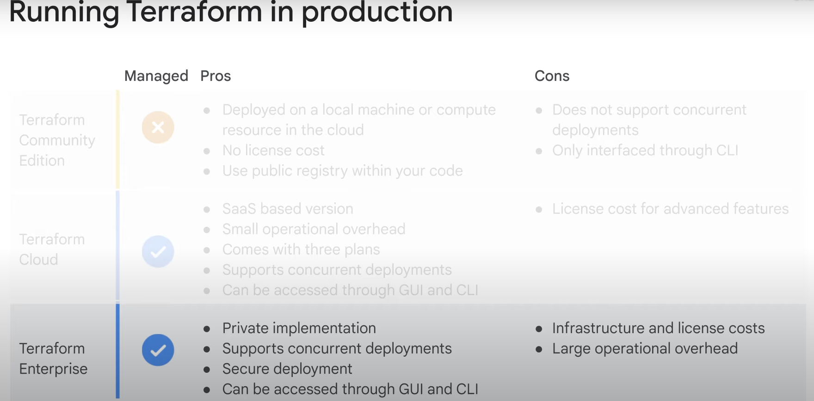
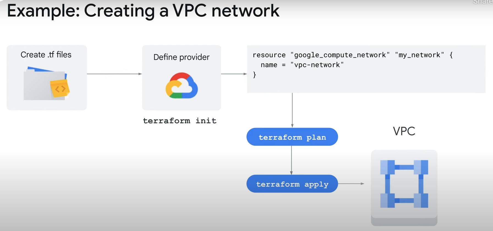

# Terraform:

## Google terraform course
- https://www.cloudskillsboost.google/paths/11/course_templates/443

## Terraform (Its for Provisioning not for configuration management)

- IaC (Infrastructure as Code)
- With IaC, you only declare the desired end state of the infrastructure –IaC handles management and provisioning.
- write your desired state.
- IaC, is about what you want.

### Benefits of IaC:
- Declarative: Specify the desired state of infrastructure, not updates.
- Code management: Commit, version, trace, and collaborate, just like source code.
- Auditable: Compare infrastructure between desired state and current state.
- Portable: Build resuable modules across an organization.

---
---

### Provisioning(example: Terraform) /vs/ configuration(example: Ansible)

#### Provisioning (Infrastructure as code):

- Used for provisioning and managing cloud resources.
- Example: Creating and provisioning a VM instance.
- Referring to frameworks that manipulate Google Cloud APIs to deploy the infrastructure.

#### Configuration Management (example: Ansible):

- Used for virtual machine OS-level configuration.
- Example: Configuring the internals of the VMs.
- Referring to package configurations and software maintenance.

---
---

- Terraform reads configuration files and provides an execution plan of changes, which can be reviewed, applied, and provisioned.
- Terraform features include: Multi-cloud and multi-API support.
- You can use Terraform for Google Cloud to provision resources, meaning you can use resource blocks to define infrastructure elements such as VMs, networks, and firewalls.
- You can create explicit dependencies between resources, so that a given resource can only be created after the creation of another resource.
- You can standardize how a given resource is created by creating reusable modules.
- you can limit the values provided for a given resource argument using validation rules.

---
---

## standard IaC configuration workflow.

- Scope: Comfirm the resources required for a project.

- Author: Author the configuration files based on the scope.
    - You then organize your code in configuration files, such as `variables`, `main`, and `tfvars`.

- Initialize: Download the provider plugins and initialize directory.
    - During this phase, you run the terraform init command, which initializes the Terraform configuration directory and installs Google Cloud as the provider.

- Plan: View execution plan for resources created, modified, or destroyed.
    - In the plan phase, you run the terraform plan command.
    - The terraform plan command provides an execution plan for the resources created, changed, or destroyed as per the configuration defined in the author phase.
    - You can then review the plan before applying it to your Google Cloud infrastructure.
 
- Apply: Create or modify actual infrastructure resources.

---
---

### Terraform use cases:
- Terraform is used to manage infrastructure.
- Whenever a new change is planned or applied, you will be prompted to approve the change before Terraform modifies the state of the infrastructure.
- When an infrastructure is created using Terraform, a state file is automatically generated.
- State files reflect the current state of your infrastructure, and provide the amount and type of Google Cloud resources modified in your configuration.

`Manage Infrastructure`: Terraform takes an immutable approach to building and managing infrastructure.

`Track changes`: Terraform enables you to review the changes before they are applied to the configuration setup.

`Automate changes`: Terraform defines the end state of the infrastructure instead of a series of steps to achieve it.

`Standardizethe configuration`: Terraform uses modules to implement best practices and improve efficincy.

---
---

### Using Terraform

- you use Terraform to create, update, or destroy infrastructure resources?
- First, you must write your infrastructure as code in configuration files.
- Terraform recognizes configuration files written in `.tf` file.
- Terraform uses this plan to create, update, or destroy resources in your infrastructure.
- Terraform generates an execution plan for the desired state, and then executes the plan to build the described infrastructure.
- Terraform determines the changes and creates incremental execution plans.
- As the configuration changes, Terraform can determine what changed and create incremental execution plans that can be applied.

---

- Terraform is available in three editions: 
  - `Community Edition`: 
    - Community Edition is a free version of the software available for download on a local machine or compute resource in the cloud.
    - No license cost.
    - Use public registry within your code.

    - Does not support concurrent deployment.
    - Only interfaced through CLI
   
   ---

  - `Cloud`:
    - SaaS based version.
    - Small operational overhead.
    - Supports concurrent deployments.
    - Can be accessed through GUI and CLI.

    - License cost for advanced features.

    ---

  - `Enterprise`:
    - Private implementation.
    - Supports concurrent deployments.
    - Secure deployment.
    - Can be access through GUI and CLI.

    - Infrastructure and license costs.
    - Large operational overhead.

---
---

 

  

  ---
  ---

### 

- Terraform on Cloud Shell is pre-authenticated.
- Cloud Shell is a Compute Engine virtual machine, and the service credentials are automatic, so there’s no need to set up a `service account key`.

- If you’re running Terraform on your workstation, authenticate by using the Cloud SDK.
- You first must install gcloud CLI, and then run the gcloud auth application-default login command to authenticate with Google Cloud.

- If you’re running Terraform in a VM on Google Cloud, configure that VM to use a Google Service Account.
- A Google Service Account allows Terraform to authenticate without a separate credential or authentication file.
- Ensure that the VM has the Google Cloud API enabled.

- If you’re running Terraform outside Google Cloud, you can use a Google Cloud Service Account with Terraform.
- From the service account key page in the Cloud Console, choose an existing account or create a new one.
- Then download the JSON key file.
- Name it something you can remember, and store it somewhere secure on your machine.
- Supply the key to Terraform using the environment variable GOOGLE_APPLICATION_CREDENTIALS, setting the value to the location of the file.
- Terraform can then use this key for authentication.
- This method does have a few limitations.
- Service account keys are short-lived.
- Key rotation is not allowed, and the keys must be protected.
- Workload identity and workload identity federation are tools for mitigating short-lived identity tokens when running Terraform outside of Google Cloud.
- Once you’ve downloaded Terraform and authenticated successfully, you’re ready to start authoring a Terraform configuration.

 

---
---

 

 

---
---

