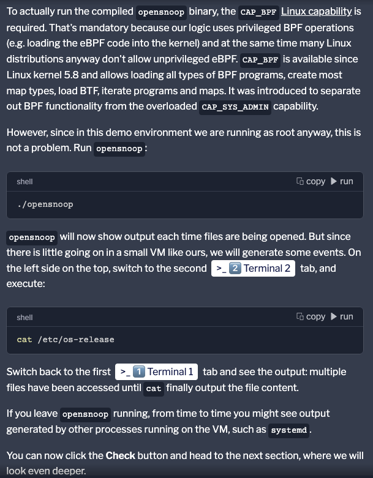
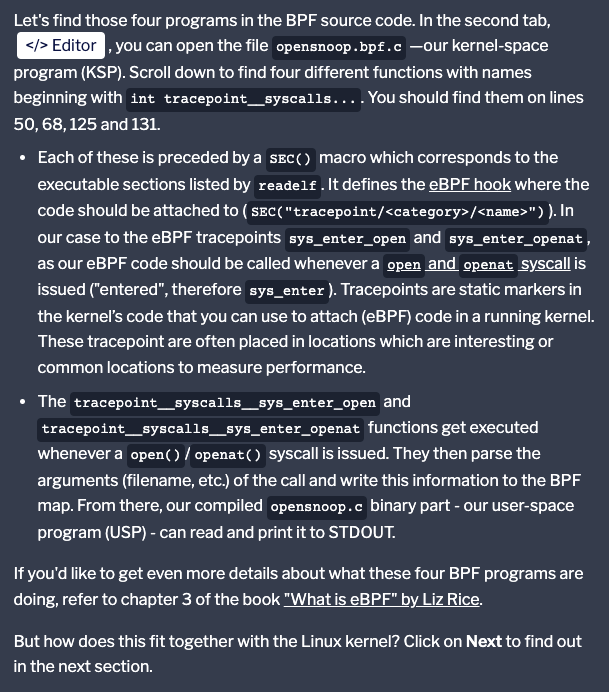

#  eBPF and Cilium Labs:
---


https://github.com/iovisor/bcc : source code for lots of observability tools

- `opensnoop` can trace `open()` syscalls system-wide, and prints various details.


```
An eBPF application usually consists out of at least two parts:

A user-space program (USP) that declares the kernel space program and attaches it to the relevant tracepoint/probe.
A kernel-space program (KSP) is what gets triggered and runs inside the kernel once the tracepoint/probe is met. This is where the actual eBPF logic is implemented.

Since these two programs aren't able to directly communicate with each other (by design), they need a buffer to exchange data. In the case of eBPF that's implemented via different kind of BPF maps. (https://docs.kernel.org/bpf/maps.html)


```

Let's build the executable: 

- `make opensnoop`

> To actually run the compiled opensnoop binary, the `CAP_BPF` Linux capability (https://man7.org/linux/man-pages/man7/capabilities.7.html) is required.





<br>

---
---

<br>


> use readelf to examine the BPF object file we built earlier as part of the make command:

> readelf --section-details --headers .output/opensnoop.bpf.o


- The object file is in ELF format. ELF stands for `Executable and Linkable Format` and it represents a common standard file format for executable files, object code, shared libraries, and core dumps. It's also the standard file format for binary files on x86 processors.


```
A few interesting things to observe:

- `Machine is Linux BPF`. Hence, this binary code is meant to be run `inside the BPF` in-kernel virtual machine.

- There is BTF information included in this file. BTF is the metadata format which encodes the debug info related to `BPF programs/maps`. This debug info is used for map pretty print, function signatures, etc.

- After the `section header` named `.text` in the table, there are `four executable` sections starting with `tracepoint`. These correspond to four BPF programs, e.g.
```


<br>


### Tracepoint: 




> our eBPF code should be called whenever a open and openat syscall is issued ("entered", therefore sys_enter).

- sys_enter_open
```
[ 3] tracepoint/syscalls/sys_enter_open
       PROGBITS         0000000000000000  0000000000000040  0
       0000000000000170 0000000000000000  0                 8
       [0000000000000006]: ALLOC, EXEC
```       

- sys_enter_openat

```
[ 5] tracepoint/syscalls/sys_enter_openat
       PROGBITS         0000000000000000  00000000000001b0  0
       0000000000000170 0000000000000000  0                 8
       [0000000000000006]: ALLOC, EXEC
```

-  sys_exit_open
```
[ 7] tracepoint/syscalls/sys_exit_open
       PROGBITS         0000000000000000  0000000000000320  0
       0000000000000330 0000000000000000  0                 8
       [0000000000000006]: ALLOC, EXEC
```

-  sys_exit_openat
```
  [ 9] tracepoint/syscalls/sys_exit_openat
       PROGBITS         0000000000000000  0000000000000650  0
       0000000000000330 0000000000000000  0                 8
       [0000000000000006]: ALLOC, EXEC
```

<br>
<br>


> eBPF hook --> https://ebpf.io/what-is-ebpf/#hook-overview

```
root@server:/opt/ebpf/bcc/libbpf-tools# readelf --section-details --headers .output/opensnoop.bpf.o
ELF Header:
  Magic:   7f 45 4c 46 02 01 01 00 00 00 00 00 00 00 00 00 
  Class:                             ELF64
  Data:                              2's complement, little endian
  Version:                           1 (current)
  OS/ABI:                            UNIX - System V
  ABI Version:                       0
  Type:                              REL (Relocatable file)
  Machine:                           Linux BPF
  Version:                           0x1
  Entry point address:               0x0
  Start of program headers:          0 (bytes into file)
  Start of section headers:          11960 (bytes into file)
  Flags:                             0x0
  Size of this header:               64 (bytes)
  Size of program headers:           0 (bytes)
  Number of program headers:         0
  Size of section headers:           64 (bytes)
  Number of section headers:         20
  Section header string table index: 1
```

<br>


```

root@server:/opt/ebpf/bcc/libbpf-tools# readelf
Usage: readelf <option(s)> elf-file(s)
 Display information about the contents of ELF format files
 Options are:
  -a --all               Equivalent to: -h -l -S -s -r -d -V -A -I
  -h --file-header       Display the ELF file header
  -l --program-headers   Display the program headers
     --segments          An alias for --program-headers
  -S --section-headers   Display the sections' header
     --sections          An alias for --section-headers
  -g --section-groups    Display the section groups
  -t --section-details   Display the section details
  -e --headers           Equivalent to: -h -l -S
  -s --syms              Display the symbol table
     --symbols           An alias for --syms
     --dyn-syms          Display the dynamic symbol table
     --lto-syms          Display LTO symbol tables
     --sym-base=[0|8|10|16] 
                         Force base for symbol sizes.  The options are 
                         mixed (the default), octal, decimal, hexadecimal.
  -C --demangle[=STYLE]  Decode mangled/processed symbol names
                           STYLE can be "none", "auto", "gnu-v3", "java",
                           "gnat", "dlang", "rust"
     --no-demangle       Do not demangle low-level symbol names.  (default)
     --recurse-limit     Enable a demangling recursion limit.  (default)
     --no-recurse-limit  Disable a demangling recursion limit
     -U[dlexhi] --unicode=[default|locale|escape|hex|highlight|invalid]
                         Display unicode characters as determined by the current locale
                          (default), escape sequences, "<hex sequences>", highlighted
                          escape sequences, or treat them as invalid and display as
                          "{hex sequences}"
     -X --extra-sym-info Display extra information when showing symbols
     --no-extra-sym-info Do not display extra information when showing symbols (default)
  -n --notes             Display the contents of note sections (if present)
  -r --relocs            Display the relocations (if present)
  -u --unwind            Display the unwind info (if present)
  -d --dynamic           Display the dynamic section (if present)
  -V --version-info      Display the version sections (if present)
  -A --arch-specific     Display architecture specific information (if any)
  -c --archive-index     Display the symbol/file index in an archive
  -D --use-dynamic       Use the dynamic section info when displaying symbols
  -L --lint|--enable-checks
                         Display warning messages for possible problems
  -x --hex-dump=<number|name>
                         Dump the contents of section <number|name> as bytes
  -p --string-dump=<number|name>
                         Dump the contents of section <number|name> as strings
  -R --relocated-dump=<number|name>
                         Dump the relocated contents of section <number|name>
  -z --decompress        Decompress section before dumping it
  -w --debug-dump[a/=abbrev, A/=addr, r/=aranges, c/=cu_index, L/=decodedline,
                  f/=frames, F/=frames-interp, g/=gdb_index, i/=info, o/=loc,
                  m/=macro, p/=pubnames, t/=pubtypes, R/=Ranges, l/=rawline,
                  s/=str, O/=str-offsets, u/=trace_abbrev, T/=trace_aranges,
                  U/=trace_info]
                         Display the contents of DWARF debug sections
  -wk --debug-dump=links Display the contents of sections that link to separate
                          debuginfo files
  -P --process-links     Display the contents of non-debug sections in separate
                          debuginfo files.  (Implies -wK)
  -wK --debug-dump=follow-links
                         Follow links to separate debug info files (default)
  -wN --debug-dump=no-follow-links
                         Do not follow links to separate debug info files
  --dwarf-depth=N        Do not display DIEs at depth N or greater
  --dwarf-start=N        Display DIEs starting at offset N
  --ctf=<number|name>    Display CTF info from section <number|name>
  --ctf-parent=<name>    Use CTF archive member <name> as the CTF parent
  --ctf-symbols=<number|name>
                         Use section <number|name> as the CTF external symtab
  --ctf-strings=<number|name>
                         Use section <number|name> as the CTF external strtab
  --sframe[=NAME]        Display SFrame info from section NAME, (default '.sframe')
  -I --histogram         Display histogram of bucket list lengths
  -W --wide              Allow output width to exceed 80 characters
  -T --silent-truncation If a symbol name is truncated, do not add [...] suffix
  @<file>                Read options from <file>
  -H --help              Display this information
  -v --version           Display the version number of readelf
root@server:/opt/ebpf/bcc/libbpf-tools# 

```


<br>

---
---

<br>


Currently `opensnoop` is not running. Let's have a look `if we have any eBPF programs running` on our machine. We can leverage `bpftool` for that —the Swiss Army knife for `working with eBPF`. It can be found on `GitHub (https://github.com/libbpf/bpftool)` or for some Linux distributions (e.g. Ubuntu and Fedora), directly in the Linux kernel repository.

<br>

opensnop added 4 more tracepoint on the ebpf: 

```
155: tracepoint  name tracepoint__syscalls__sys_enter_open  tag 07014be5359438f8  gpl
        loaded_at 2024-09-23T23:09:30+0000  uid 0
        xlated 240B  jited 137B  memlock 4096B  map_ids 53,50
        btf_id 137
        pids opensnoop(4102)
157: tracepoint  name tracepoint__syscalls__sys_enter_openat  tag 8ee3432dcd98ffc3  gpl
        loaded_at 2024-09-23T23:09:30+0000  uid 0
        xlated 240B  jited 137B  memlock 4096B  map_ids 53,50
        btf_id 137
        pids opensnoop(4102)
158: tracepoint  name tracepoint__syscalls__sys_exit_open  tag 37f628f9e857b071  gpl
        loaded_at 2024-09-23T23:09:30+0000  uid 0
        xlated 792B  jited 546B  memlock 4096B  map_ids 50,53,51
        btf_id 137
        pids opensnoop(4102)
159: tracepoint  name tracepoint__syscalls__sys_exit_openat  tag 37f628f9e857b071  gpl
        loaded_at 2024-09-23T23:09:30+0000  uid 0
        xlated 792B  jited 546B  memlock 4096B  map_ids 50,53,51
        btf_id 137
        pids opensnoop(4102)
```

