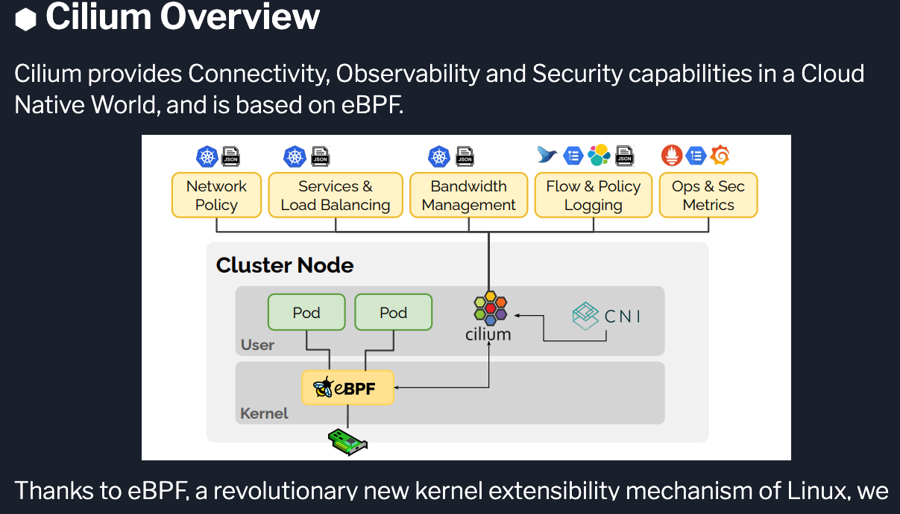

### Links:
- https://isovalent.com/learning-tracks/#platformOps

-  https://isovalent.com/labs


---
---





```
Hubble
Also, meet Hubble: Hubble is a fully distributed networking and security observability platform for Cloud Native workloads.

Hubble is an open source software and is built on top of Cilium and eBPF to enable deep visibility into:

the communication and behavior of services as well as
the networking infrastructure in a completely transparent manner
```

