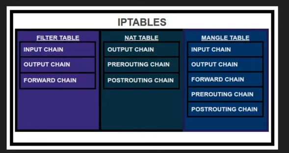
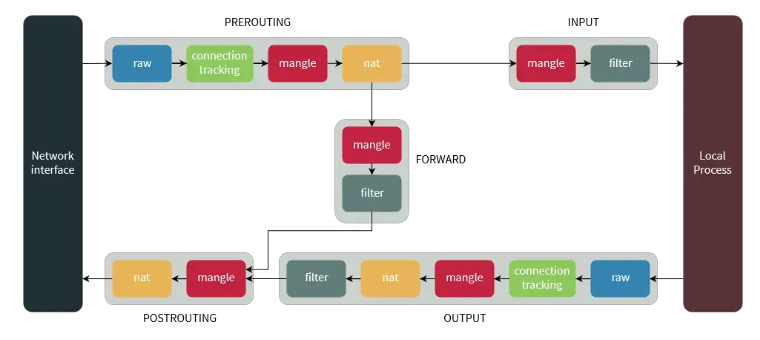
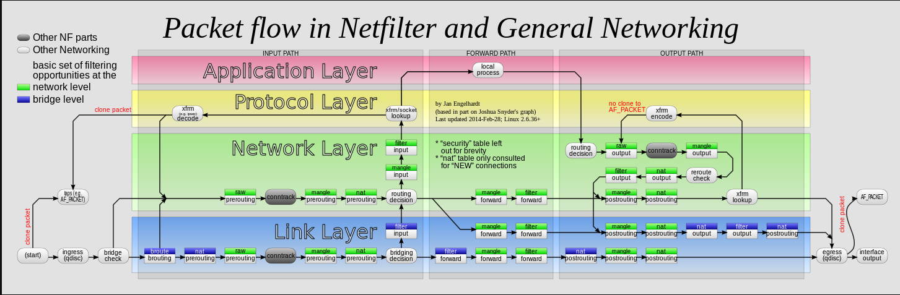

## Questions:
How Iptables inspecting and filtering network traffic.


# Random notes:

- https://santoshk.dev/posts/2023/iptables-explained-an-introduction-to-linux-firewalling/
- iptables is a tool to manipulate network packets.
- Iptables is a powerful and versatile firewall tool that is used to protect and secure networks

<br>

---
---

Links: 

https://www.youtube.com/watch?v=6Ra17Qpj68c

https://www.digitalocean.com/community/tutorials/a-deep-dive-into-iptables-and-netfilter-architecture

https://www.netfilter.org/documentation/HOWTO/netfilter-hacking-HOWTO-3.html

https://www.frozentux.net/iptables-tutorial/chunkyhtml/c3965.html

http://ipset.netfilter.org/iptables-extensions.man.html

http://ebtables.netfilter.org/br_fw_ia/br_fw_ia.html

[1] -- https://backreference.org/2010/06/11/iptables-debugging/

https://web.archive.org/web/20160413034150/https://jonatan.nilsson.is/running-a-semi-stateless-linux-router-for-private-network/


<br>

---
---

<br>

## `IMP`:

Traffic first fall into chain of different tables supporting that chain,and then Rules in that tables related to that chain.

- (`for input to the system`):
    - raw table's PREROUTING chain > mangle table's PREROUTING chain > nat table's PREROUTING chain.
    - mangle table's INPUT chain > filter table's INPUT chain.
    - raw table's OUTPUT chain > mangle table's OUTPUT chain > nat table's OUTPUT chain > filter table's  OUTPUT chain.
    - mangle table's POSTROUTING chain > nat table's POSTROUTING chain.

- (`for forwarding packets`):
    - raw table's PREROUTING chain > mangle table's PREROUTING chain > nat table's PREROUTING chain.
    - mangle table's FORWARD chain > filter table's FORWARD chain.
    - mangle table's POSTROUTING chain > nat table's POSTROUTING chain.
<br>


<br>

---
---

<br>

### Targets
As we’ve mentioned before, chains allow you to filter traffic by adding rules to them. So for example, you could add a rule on the filter table’s INPUT chain to match traffic on port 22. But what would you do after matching them? That’s what targets are for — they decide the fate of a packet.

Some targets are terminating, which means that they decide the matched packet’s fate immediately. The packet won’t be matched against any other rules. The most commonly used terminating targets are:


<br>

| Target Name | Description | Table |
| --- | --- | --- |
| ACCEPT | This causes iptables to accept the packet. | All tables |
| DROP | iptables drops the packet. | All tables |
| REJECT | iptables “rejects” the packet. | All tables |
| RETURN | The packet is returned to the previous chain. | All tables |
| DNAT | Destination NAT. | nat table |
| SNAT | Source NAT. | nat table |
| MASQUERADE | Similar to SNAT, but the source IP address is set to the IP address of the outgoing interface. | nat table |
| REDIRECT | Redirect the packet to the machine itself. | nat table |
| LOG | Log the packet. | All tables |
| ULOG | Log the packet to a userspace logging daemon. | All tables |
| REJECT | Reject the packet and send an error packet back. | All tables |
| MARK | Set a mark on the packet for use in advanced routing. | mangle table |
| TOS | Set the Type of Service (TOS) field in the packet. | mangle table |
| TTL | Set the Time to Live (TTL) field in the packet. | mangle table |
| DSCP | Set the Differentiated Services Code Point (DSCP) field in the packet. | mangle table |
| ECN | Set the Explicit Congestion Notification (ECN) field in the packet. | mangle table |
| CONNMARK | Set the connection mark for the packet. | mangle table |
| CONNSECMARK | Set the connection security mark for the packet. | mangle table |
| TCPMSS | Set the TCP Maximum Segment Size (MSS) for the packet. | mangle table |
| TRACE  | Enable IP tracing for the packet. | mangle table |
| MIRROR | Mirror the packet. | mangle table |
| QUEUE | Queue the packet for userspace processing. | mangle table |
| SET | Set the packet’s mark, TTL, TOS, DSCP, ECN, or IP header fields. | mangle table |
| SETRF | Set the packet’s routing flags. | mangle table |


#### Example:

> iptables -t raw -A PREROUTING  p -j TRACE

> iptables -t raw -A OUTPUT -j TRACE

<br> 

Docker connectivity:
> iptables -t raw -A OUTPUT -i docker0 -j TRACE

`OUTPUT` chain of `RAW` table for `docker0` interface with `TRACE` traget.


```

- iptables can use extended packet matching modules with the -m or --match options, followed by the matching module name
- Some important ones
    - connmark [!] --mark value[/mask] Matches packets in connections with the given mark value (if a mask is specified, this is logically ANDed with the mark before the comparison).
    - conntrack  [!] --ctstate state Matches packets with given conntrack state.
    - ipvs   [!] --ipvs dport:portname Matches packets with given ipvs portname.
    - mark    [!] --mark value[/mask] Matches packets with the given mark value (if a mask is specified, this is logically ANDed with the mark before the comparison). 

    - redirect This target is only valid in the nat table, in the PREROUTING and OUTPUT chains, and user-defined chains which are only called from those chains. It redirects the packet to the machine itself by changing the destination IP to the primary address of the incoming interface (locally-generated packets are mapped to the localhost address, 127.0.0.1 for IPv4 and ::1 for IPv6).

```


### Bridge Filters :


- `ebtables` is a filtering tool for a Linux-based bridging firewall.
- `ebtables` can be used together with the other basic tools used for bridging, like `brctl`.
- `ebtables` is analogous to `iptables`, but `ebtables` is for a bridging firewall, while `iptables` is for a routing firewall.
- `ebtables` can be used to examine and modify the Ethernet frames as they make their way through a bridge.
- `ebtables` is used to set up, maintain, and inspect the tables of Ethernet frame rules in the Linux kernel.

### ebtables Tables

- `ebtables` has three tables:
    - `filter`: This table is used to drop or allow packets.
    - `nat`: This table is used to make network address translations.
    - `broute`: This table is used to make bridging route decisions.

### ebtables Chains

- `ebtables` has five built-in chains:
    - `INPUT`: This chain is used to filter incoming packets.
    - `OUTPUT`: This chain is used to filter outgoing packets.
    - `FORWARD`: This chain is used to filter forwarded packets.
    - `PREROUTING`: This chain is used to filter packets before routing decisions are made.
    - `POSTROUTING`: This chain is used to filter packets after routing decisions are made.

### ebtables Targets

- `ebtables` has several targets:
    - `ACCEPT`: This target is used to accept packets.
    - `DROP`: This target is used to drop packets.
    - `CONTINUE`: This target is used to continue processing the packet in the current chain.
    - `RETURN`: This target is used to return the packet to the previous chain.
    - `dnat`: This target is used to make network address translations.
    - `snat`: This target is used to make source network address translations.
    - `dscp`: This target is used to set the DSCP field in the packet.
    - `mark`: This target is used to set the mark field in the packet.
    - `log`: This target is used to log packets.
    - `ulog`: This target is used to log packets to a userspace logging daemon.
    - `redirect`: This target is used to redirect packets to a different destination.


```
graph LR
    A[Packet Arrival] -->|PREROUTING|> B[Raw Table]
    B -->|PREROUTING|> C[Mangle Table]
    C -->|PREROUTING|> D[NAT Table]
    D -->|Routing Decision|> E[Forward Chain]
    E -->|FORWARD|> F[Mangle Table]
    F -->|FORWARD|> G[Filter Table]
    G -->|FORWARD|> H[POSTROUTING]
    H -->|POSTROUTING|> I[Mangle Table]
    I -->|POSTROUTING|> J[NAT Table]
    J --> K[Packet Departure]
    L[Local Process] -->|OUTPUT|> M[Raw Table]
    M -->|OUTPUT|> N[Mangle Table]
    N -->|OUTPUT|> O[NAT Table]
    O -->|OUTPUT|> P[Filter Table]
    P -->|OUTPUT|> Q[POSTROUTING]
    Q -->|POSTROUTING|> R[Mangle Table]
    R -->|POSTROUTING|> S[NAT Table]
    S --> T[Packet Departure]
    U[Packet Arrival] -->|PREROUTING|> V[Raw Table]
    V -->|PREROUTING|> W[Mangle Table]
    W -->|PREROUTING|> X[NAT Table]
    X -->|Routing Decision|> Y[INPUT Chain]
    Y -->|INPUT|> Z[Mangle Table]
    Z -->|INPUT|> AA[Filter Table]
    AA --> BB[Local Process]
```  

<br>

---
---

<br>





<br>


| Table Name | Description | Built-in Chains |
| --- | --- | --- |
| Filter | Default table, used to filter packets based on criteria such as source and destination IP addresses, port numbers, and protocols. | INPUT, FORWARD, OUTPUT |
| NAT | Used to route packets to different hosts on NAT networks by changing the source and destination addresses of packets. | PREROUTING, POSTROUTING, OUTPUT |
| Mangle | Used to alter packet headers in various ways, such as changing TTL values. | PREROUTING, OUTPUT, INPUT, FORWARD, POSTROUTING |
| Raw | Used for connection tracking, allows you to work with packets before the kernel starts tracking its state. | PREROUTING, OUTPUT |
| Security | SELinux policy is applied on the packets. | - |    

<br>


<br>

---
---

<br>


### Chains:

<br>



<br>

<b> We organize chains through the tables, but: </b> 

Logically: the traffic flow through `chains` of different `tables` as follows: (`for input to the system`):
- **PREROUTING** (chain) - `Rules in this chain apply to packets as they just arrive on the network interface.`
    - raw table
    - mangle table
    - nat table

- **INPUT** (chain) - `Rules in this chain apply to packets just before they’re given to a local process.`
    - mangle table
    -  filter table

- **OUTPUT** (chain) - `The rules here apply to packets just after they’ve been produced by a process.`
    - raw table
    - mangle table
    - nat table
    - filter table

- **POSTROUTING** (chain) - `The rules in this chain apply to packets as they just leave the network interface`
    - mangle table
    - nat table


<br>

#### for PREROUTING related rules from different tables.

```
sudo iptables -t raw -n -L PREROUTING
sudo iptables -t mangle -n -L PREROUTING
sudo iptables -t nat -n -L PREROUTING   
```

<br>


### Path 1  (for input to the system)

| Chain Name | Description | Table |
| --- | --- | --- |
| PREROUTING | Modify packets before routing. | Raw, Mangle, NAT |
| INPUT | Filter incoming network traffic. | mangle, Filter |
| OUTPUT | Modify locally generated packets. | Raw, Mangle, NAT |
| OUTPUT | Filter outgoing network traffic. | Filter |
| POSTROUTING | Modify packets after routing. |Mangle,  NAT |

<br>


So, logically: the traffic flow through `chains` of different  `tables` is as follows: (for forwarding packets)
- **PREROUTING** (chain)
    - raw table
    - mangle table
    - nat table

- **FORWARD** (chain) - `The rules here apply to any packets that are routed through the current host.`
    - mangle table
    - filter table

- **POSTROUTING** (chain)
    - mangle table
    -  nat table
    

### Path 2 (for forwarding packets)

| Chain Name | Description | Table |
| --- | --- | --- |
| PREROUTING | Modify packets before routing. | Raw, Mangle, NAT |
| FORWARD | Filter network traffic that is being forwarded by the firewall. | mangle, Filter |
| POSTROUTING | Modify packets after routing. | Mangle, NAT |


<br>

---
---

<br>

### The packet flow


- `Bridges` work at the `MAC (Media Access Control) address level`, forwarding frames based on the destination `MAC address`.

- `Network` work at `IP address level`, forwarding packets based on the destination IP address.

- Bridge level operates at Layer 2 (MAC addresses), while network level operates at Layer 3 (IP addresses).


###  Order of Chain evaluation across tables
-`raw` : Used to bypass connection tracking
- (connection tracking enabled)
- `mangle`  : Used to modify packet and connection properties
- `nat` (DNAT) 
- (routing decision)
-  `filter` : Used to filter packets
- `security`: (connection tracking disabled)
- `nat` (SNAT)

<br>

---
---

<br>


The Linux kernel comes with a packet filtering framework named `netfilter`.  `netfilter` is a set of hooks inside the Linux kernel that allows you to filter network packets. `iptables` is a user-space program that uses the `netfilter` framework to filter network.   `iptables` is a command-line tool that allows you to configure the `netfilter` framework. `iptables` is used to filter network traffic based on various criteria such as source and destination IP. `iptables` is also used to configure network address translation (NAT) and other network-related. 


The packet filtering mechanism provided by iptables is organized into `three different` kinds of structures: `tables`, `chains` and `targets`. The default table is the `filter` table.  The `filter` table is used to filter network traffic. The `filter` table is divided into  `three` different chains: `INPUT`, `OUTPUT` and `FORWARD`. The `INPUT.

`chain` is used to filter incoming network traffic:
The `INPUT` chain is used to filter network traffic that is coming into the firewall.
The `OUTPUT` chain is used to filter outgoing network traffic. 
The `FORWARD` chain is used to filter network traffic that is being forwarded by the firewall.  


<br>

---
---

<br>


### We have 5 tabels and 3 main constructs:

- Tables  (`5 types of tables`)
    - `Filter` Table:
        - This is the default and perhaps the most widely used table. It is used to make decisions about whether a packet should be allowed to reach its destination.
        - This is the default tables. Meaning that if on command line if you don’t specify any table, program will assume filter table.
        - Role of this table is to filter packets based on criteria such as the source and destination IP addresses, port numbers, and protocols.
        - This table contains `three built-in chains`, that are used to process incoming, forwarded, and outgoing packets, respectively.
            - `Input` (built-in chains)
            - `Forward` (built-in chains)
            - `Output` (built-in chains)

            ```
            # iptables -t filter -n -L
            # sudo iptables -t filter --list
            ```


    - `NAT` Table:
        - This table allows you to route packets to different hosts on NAT (Network Address Translation) networks by changing the source and destination addresses of packets. It is often used to allow access to services that can’t be accessed directly, because they’re on a NAT network.
        - Role of this table is to modify destination or source headers in order to route packet in NAT setup where direct access is not possible.
        - NAT Table is used to translate IP addresses and/or port numbers in packets as they pass through the firewall.
        - This table contains `three built-in chains`, that are used to modify packets before and after routing.
            - `PREROUTING` (built-in chains)
            - `POSTROUTING` (built-in chains)
            - `OUTPUT` (built-in chains)
            ```
            sudo iptables -t nat --list
            ```

    - `Mangle` Table:
        - This table allows you to alter packet headers in various ways, such as changing TTL values.
        - The Mangle Table is used to modify packets in ways that are more complex than those allowed by the Filter and NAT Tables.
        - This table can be used to alter packet header information, mark packets for special handling, and perform other advanced packet processing tasks.
        - The Mangle Table contains `five built-in chains, that allow packets to be processed at various stages of their journey through the firewall.
            - `PREROUTING` (built-in chains)
            - `OUTPUT` (built-in chains)
            - `INPUT` (built-in chains)
            - `FORWARD` (built-in chains)
            - `POSTROUTING` (built-in chains)
            ```
            sudo iptables -t mangel --list
            ```

    - `Raw` Table:
        - Used for connection tracking.
        - iptables is a stateful firewall, which means that packets are inspected with respect to their “state”. (For example, a packet could be part of a new connection, or it could be part of an existing connection.) The raw table allows you to work with packets before the kernel starts tracking its state. In addition, you can also exempt certain packets from the state-tracking machinery.
        - This table contains `three built-in chains`, that are used to process packets before the kernel
            - `PREROUTING` (built-in chains)
            - `OUTPUT` (built-in chains)
            - `INPUT` (built-in chains)
            ```
            sudo iptables -t raw --list
            ```
            

    - `Security` Table:
        - SELinux policy is applied on the packets.
        - This table is used to enforce SELinux policy on packets.
        - This table contains `three built-in chains`, that are used to process packets before the kernel
            - `INPUT` (built-in chains)
            - `OUTPUT` (built-in chains)
            - `FORWARD` (built-in chains)
            ```
            sudo iptables -t security --list
            ```


<br>

---
---

<br>


